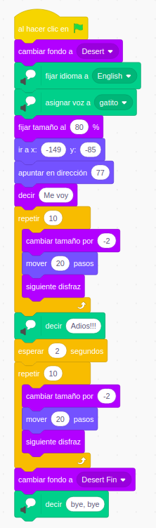
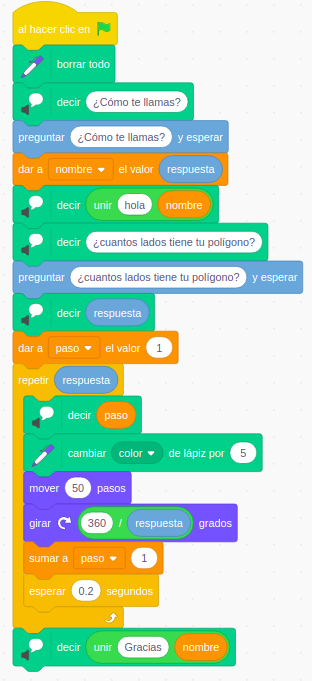
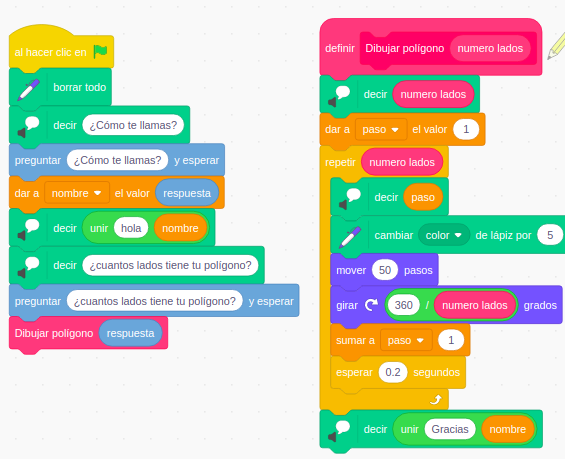
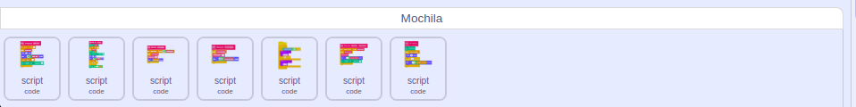
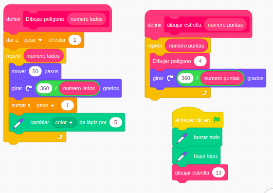
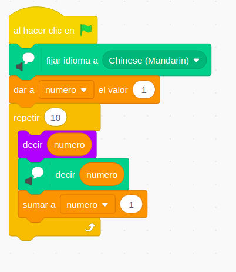
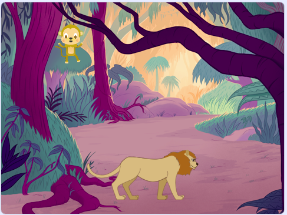
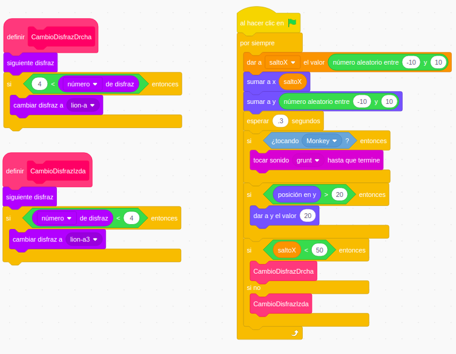
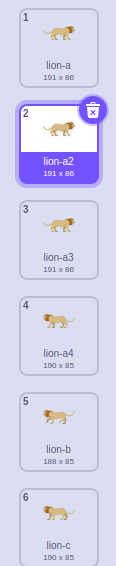
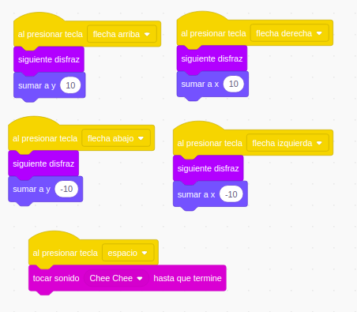

# Iniciación a la programación con Scratch ()

## Curso del CEP de Antequera

## Noviembre de 2019

### José Antonio Vacas @javacasm

## https://github.com/javacasm/ScratchAntequera

# Ejemplos

## Gatito moviéndose en el desierto

* Movemos nuestro gatito
* Colocamos en una posición inicial y le damos un tamaño
* Animamos, cambiando entre los dos fotogramas del disfraz y haciendo que vaya cambiando de tamaño al alejarse
* Hacemos que hable con la extensión TTS
* Cambiamos entre los 2 fondos/escenarios

[Proyecto](https://scratch.mit.edu/projects/342153802/)

## Dibujamos polígonos

* Dibujamos polígonos usando la extensión Lápiz
* Nos movemos y giramos
* Usamos bucles para repetir acciones
* Preguntados al usuario y usamos su respuesta
* Usamos variables para guardar datos
* Hacemos cálculos con los operadores matemáticos y guardamos en variables
* Usamos la extensión TTS para hablar

[Proyecto](https://scratch.mit.edu/projects/342175162/)

## Creando nuestro bloques: dibuja-Poligono

¿Y si queremos dibujar varios polígonos? ¿Copiamos y pegamos varias veces nuestro bloques?

A partir del ejemplo anterior vemos la conveniencia de definir un bloque que nos permite dibujar fácilmente un polígono de **N** lados. 

Para ello vamos a "Mis Bloques" y creamos uno nuevo. Tendrá una entrada (argumento) de tipo numérico para que le podamos indicar el número de lados que queremos que tenga

Una vez creado lo podemos usar sin más indicarle cuantos tendrá nuestro polígono

Para usar este bloque en otro proyecto sólo tenemos que arrastrarlo a nuestra mochila

[Proyecto](https://scratch.mit.edu/projects/344212953)

## Reaprovechando el bloque dibuja-poligono

A partir del bloque creado dibujaremos estrellas, ya que sabemos su utilidad crearemos otro bloque las dibuje

Que también guardaremos en nuestra mochila

[Proyecto](https://scratch.mit.edu/projects/344217567/)

## Hablamos en otros idiomas, por ejemplo chino

* Usamos una imagen que descargamos para nuestro personaje. La [imagen usada](https://cdn.pixabay.com/photo/2017/11/07/01/00/buddha-2925330_960_720.png) tiene fondo transparente para facilitar la integración con el escenario. Para ello buscamos imágenes con fondo transparente
* Usamos la extensión TTS para hablar
* Seleccionamos el idioma
* Usamos una variable para crear el bucle y hacer que diga los números en Chino

[Proyecto](https://scratch.mit.edu/projects/342194982/)

## Juego de persecución

Juego de persecución entre 2 personajes, uno que controlamos nosotros con teclas y otro con movimiento automático

Movemos de modo automático y aleatorio el león

Para adecuar el disfraz usamos los bloques de cambio de disfraz entre los 3 que miran a un lado y los otros 3 que miran al otro. También podíamos haberlo hecho con lo pares e impares

El mono lo movemos manualmente mediante teclas

[Proyecto](https://scratch.mit.edu/projects/344239241/)

Podemos usar la placa Makey-Makey para controlar los movimientos

# Ejemplos de videojuegos

Veamos algunos ejemplos de juegos y cómo implementarlos en scratch

## El muro (arkanoid)

* Cada ladrillo es un clon. Los colocamos haciendo dos bucles anidados: en y (podemos aprovechar para cambiar el color/disfraz) y dentro uno en x (las variables x e y deben ser globales)
* Podemos hacer que el ángulo en el que sale la bola sea diferente según la parte de la raqueta con la que choque (así es en el original) para poder darle efectos a la bola.

Vemos como la detección es a nivel de objeto, no de clon

## Conducir coche 2D (psicotecnico)

Usamos el color de la carretera/del exterior para ver si conducimos por dentro o no

## Marcianitos (que bajan o suben)

* Nave
* Disparo (aparece a partir de la pulsación del disparo, toma la x de la nave en su inicio)
* Marciano (los clonamos como los ladrillos del arkanoid)

## Pong

* Pelota (que rebota en los bordes)
* Raquetas (2 jugadores o el ordenador usa una)
